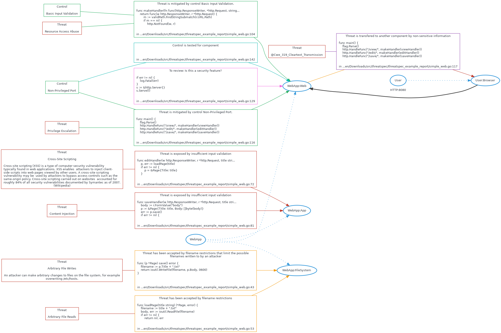

# threatspec project Threat Model

A threatspec project.


# Diagram



# Exposures

## Cross-site scripting against WebApp:App
insufficient input validation


```
func editHandler(w http.ResponseWriter, r *http.Request, title string) {
    p, err := loadPage(title)
    if err != nil {
        p = &Page{Title: title}
    }

```
/home/zeroxten/Downloads/src/threatspec/threatspec_example_report/simple_web.go:72

## Content injection against WebApp:App
insufficient input validation


```
func saveHandler(w http.ResponseWriter, r *http.Request, title string) {
    body := r.FormValue("body")
    p := &Page{Title: title, Body: []byte(body)}
    err := p.save()
    if err != nil {

```
/home/zeroxten/Downloads/src/threatspec/threatspec_example_report/simple_web.go:81


# Acceptances

## Arbitrary file writes to WebApp:FileSystem
filename restrictions that limit the possible filenames written to by an attacker


```
func (p *Page) save() error {
    filename := p.Title + ".txt"
    return ioutil.WriteFile(filename, p.Body, 0600)
}


```
/home/zeroxten/Downloads/src/threatspec/threatspec_example_report/simple_web.go:43

## Arbitrary file reads to WebApp:FileSystem
filename restrictions


```
func loadPage(title string) (*Page, error) {
    filename := title + ".txt"
    body, err := ioutil.ReadFile(filename)
    if err != nil {
        return nil, err

```
/home/zeroxten/Downloads/src/threatspec/threatspec_example_report/simple_web.go:53


# Threats
## Resource access abuse

## Privilege escalation

## Cross-site scripting
### Description
Cross-site scripting (XSS) is a type of computer security vulnerability typically found in web applications. XSS enables 
attackers to inject client-side scripts into web pages viewed by other users. A cross-site scripting vulnerability may be 
used by attackers to bypass access controls such as the same-origin policy. Cross-site scripting carried out on websites 
accounted for roughly 84% of all security vulnerabilities documented by Symantec as of 2007. (Wikipedia)


## Content injection

## @cwe_319_cleartext_transmission

## Arbitrary file writes
### Description
An attacker can make arbitrary changes to files on the file system, for example overwriting /etc/hosts.


## Arbitrary file reads
